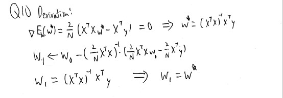

# Homework 2
1. (d)<br>
   <br>
2. (a)<br>
   Prove: There is two upper bound for d_vc, one is depend on the dimension of x which is d_vc <= 6210 + 1, and the other one is depend on the number of perceptrons, since one perceptron can implement one dichotomy, we can use 2^N <= 1126 to find out d_vc <= lg(1126). And it is obvious that d_vc <= lg(1126) is a tighter bound.
3. (e)<br>
   Prove:<br>
   (a) d_vc = 4, since for N = 5, we can't implement {1, -1, 1, -1, 1} this dichotomy.<br>
   (b) d_vc = 4, since mh(5) < 2^5, because {1, -1, 1, -1, 1} and {-1, 1, -1, 1, -1} are both not dichotomies.<br>
   (c) d_vc = infinity, since sin is a oscillation function by putting N points properly we can implement 2^N dichotomies by changing different w.<br>
   (d) d_vc = 4, since no set of 5 points can be fully shattered. By similar labeling in (e) we can label four extreme point plus one inside the four. Then it is impossible to label the point inside negative while the extreme points is labeled positively.<br>
   (e) d_vc = 3, since no set of 4 points can be fully shattered. We can label four extreme points with P_top, P_down, P_left, P_right. Assuming P_top_y - P_down_y > P_right_x - P_left_x, then P_top and P_down can't be labeled positively while P_left and P_right are labeled negatively.<br>
4. (b)<br>
   <br>
5. (b)<br>
   • some set of d distinct inputs is shattered by H<br>
   • any set of d + 1 distinct inputs is not shattered by H<br>
6. (b)<br>
   <br>
7. (e)<br>
   
8. (a)<br>
   <br>
9. (b)<br>
   <br>
10. (a)<br>
    <br>
11. (d)<br>
    <br>
12. (d)<br>
    <br>
13. (b)<br>
14. (b)<br>
15. (c)<br>
16. (b)<br>
<br>
```Python
import numpy as np
import random

size = 2    #change this for different size
test = 10000
r = 0    #change this for different r
x_array = np.zeros(size)
y_array = np.zeros(size)
theta_array = np.zeros(size)
theta_array[0] = -0.5    #for -inf
s_array = np.array([-1,1])
E_out_minus_E_in = np.zeros(test)
for i in range(test):
    for j in range(size):
        x = random.uniform(-0.5, 0.5)
        x_array[j] = x
    x_array = np.sort(x_array)
    for j in range(size):
        rand = random.uniform(0,1)
        if rand < r:
            if x_array[j] > 0:
                y_array[j] = -1
            else:
                y_array[j] = 1
        else:
            if x_array[j] > 0:
                y_array[j] = 1
            else:
                y_array[j] = -1
    for j in range(size-1):
        theta_array[j+1] = (x_array[j] + x_array[j+1]) / 2
    opt_s = 0
    opt_theta = 0
    E_in = 1
    for j in range(2):
        wrong_data = 0
        for k in range(size):
            if y_array[k] != s_array[j]:
                wrong_data += 1
        for k in range(size):
            tmp = wrong_data / size
            if tmp < E_in:
                E_in = tmp
                opt_s = s_array[j]
                opt_theta = theta_array[k]
            if tmp == E_in and s_array[j] * theta_array[k] < opt_s * opt_theta:
                E_in = tmp
                opt_s = s_array[j]
                opt_theta = theta_array[k]
            if y_array[k] == s_array[j]:
                wrong_data += 1
            else:
                wrong_data -= 1
    E_out = abs(opt_theta) * (1-2*r) + r
    E_out_minus_E_in[i] = E_out - E_in

print(np.mean(E_out_minus_E_in))

```
<br>
17. (c)<br>
18. (e)<br>
19. (d)<br>
20. (c)<br>
<br>
```Python
import numpy as np
import random

filename_1 = 'data.txt'
filename_2 = 'data-test.txt'

inf = 1000000
s_array = np.array([1, -1])

train_size = 192
train_array = np.ones([train_size, 11])
with open(filename_1) as file:
    a = 0
    for line in file:
        line = line.strip().split()
        for i in range(11):
            train_array[a][i] = line[i]
        a += 1
file.close()

test_size = 64
test_array = np.ones([test_size, 11])
with open(filename_2) as file:
    a = 0
    for line in file:
        line = line.strip().split()
        for i in range(11):
            test_array[a][i] = line[i]
        a += 1
file.close()

opt_s = 0
opt_theta = 0
opt_i = 0
E_in = 1
opt_s_wob = 0
opt_theta_wob = 0
opt_i_wob = 0
E_in_wob = 0
opt_s_wob_2 = 0
opt_theta_wob_2 = 0
opt_i_wob_2 = 0
theta_array = np.zeros(train_size)
theta_array[0] = -inf
for i in range(10):
    tmp_wob = 1
    train_array = train_array[train_array[:, i].argsort()]
    for j in range(train_size-1):
        theta_array[j+1] = (train_array[j][i] + train_array[j+1][i]) / 2
    for j in range(2):
        wrong_data = 0
        for k in range(train_size):
            if train_array[k][10] != s_array[j]:
                wrong_data += 1
        for k in range(train_size):
            tmp = wrong_data / train_size
            if tmp < E_in:
                E_in = tmp
                opt_theta = theta_array[k]
                opt_s = s_array[j]
                opt_i = i
            elif tmp == E_in and s_array[j] * theta_array[k] < opt_s * opt_theta:
                E_in = tmp
                opt_theta = theta_array[k]
                opt_s = s_array[j]
                opt_i = i
            if tmp < tmp_wob:
                tmp_wob = tmp
                opt_theta_wob_2 = theta_array[k]
                opt_s_wob_2 = s_array[j]
                opt_i_wob_2 = i
            elif tmp == tmp_wob and s_array[j] * theta_array[k] < opt_s_wob_2 * opt_theta_wob_2:
                tmp_wob = tmp
                opt_theta_wob_2 = theta_array[k]
                opt_s_wob_2 = s_array[j]
                opt_i_wob_2 = i    
            if train_array[k][10] == s_array[j]:
                wrong_data += 1
            else:
                wrong_data -= 1
        if tmp_wob > E_in_wob:
            E_in_wob = tmp_wob
            opt_i_wob = opt_i_wob_2
            opt_s_wob = opt_s_wob_2
            opt_theta_wob = opt_theta_wob_2
print(E_in)    #Q17
print(E_in_wob)     
print(E_in_wob - E_in)     #Q19

test_array = test_array[test_array[:, opt_i].argsort()]
wrong_data = 0
wrong_data_wob = 0
for i in range(test_size):
    if (opt_s * (test_array[i][opt_i] - opt_theta) > 0 and test_array[i][10] == -1) or (opt_s * (test_array[i][opt_i] - opt_theta) <= 0 and test_array[i][10] == 1):
        wrong_data += 1
    if (opt_s_wob * (test_array[i][opt_i_wob] - opt_theta_wob) > 0 and test_array[i][10] == -1) or (opt_s_wob * (test_array[i][opt_i_wob] - opt_theta_wob) <= 0 and test_array[i][10] == 1):
        wrong_data_wob += 1
E_out = wrong_data / test_size
E_out_wob = wrong_data_wob / test_size
print(E_out)    #Q18
print(E_out_wob)
print(E_out_wob - E_out)    #Q20

```
